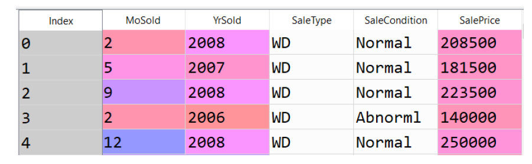

# Multiple Linear Regression (Machine Learning)

# Exercise 1 
Use the attached dataset “HousePrice.csv” to predict the sale price of a house. Separate 30 % of the data (randomly) into a test dataset and leave the rest 70 % of the data into a train dataset. Then use the train dataset to build a linear regression model with the living area as your input variable. Report the accuracy of your model with the following indicators:

• Mean absolute error for both train and test datasets
• R2 score for both train and test datasets
• Plots for both train and test datasets

# Exercise 2 
Repeat the previous exercise, but add the following variables to your input variables:
• Lot area, Year of building, House style
Report also the relative importance of each input variable measured by the regression coefficient.
(NOTE: Comparing regression coefficients is valid only if your input variables are scaled.)

# Exercise 3
Repeat the previous exercise, but add the following variable to your input variables:
• Neighborhood
(HINT: Since this is a classification variable, you must create a binary “dummy” variable for each neighborhood. The collection of these dummy variables is also called the “one-hot” form of the Neighborhood variable.)

# Exercise 4
The attached dataset roasting_data.csv shows the following measurements for each time step in a roasting process:
• sensor readings from 15 temperature sensors
• sensor readings from a humidity sensor
• sensor readings from a thickness sensor
• quality of the end product

Train a linear regression model, which predicts the end product quality based on the sensor measurements. Report the mean absolute errors in both train and test data. Also report which temperature sensors have the most impact on the quality. Use a random split of 70 % - 30 % between the train and test data.
